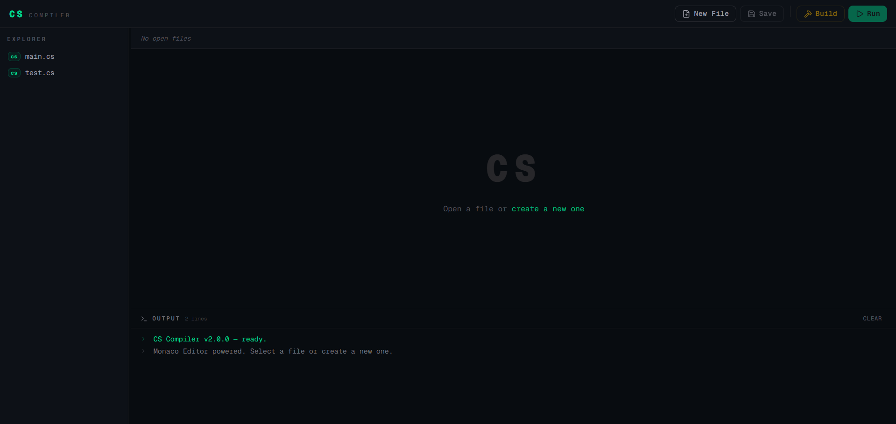

# CS Compiler

A compiler for the **CS** (Type-See) programming language, developed as part of the PPL course.
CS is a simple C-like language featuring a complete type inference system, strict type checking, and procedural programming constructs.

---

## Table of Contents

- [1. CS Language Overview](#1--cs-language-overview)
- [2. Compiler Architecture](#2--compiler-architecture)
- [3. Backend API](#3--backend-api)
- [4. Docker & CI/CD](#4--docker--cicd)
- [5. Deploy to Azure](#5--deploy-to-azure)
- [6. UI](#6--ui)
- [7. Proxy & Cache with Nginx](#7--proxy--cache-with-nginx)

---

## 1. 🚀 CS Language Overview

**CS** (pronounced "type-see") is a simple C-like programming language designed for students practicing compiler implementation. It features:

- Complete **type inference** using `auto`
- Strict **type checking** with well-defined operator rules
- Procedural constructs: functions, variables, control flow (`if`, `while`, `for`, `switch-case`)
- Composite types via `struct`
- Built-in I/O functions

### Supported Types

| Type | Description |
|------|-------------|
| `int` | Integer numbers |
| `float` | Floating-point numbers |
| `string` | String values |
| `void` | No return value |
| `auto` | Type inferred by compiler |
| `struct` | User-defined composite types |

### Keywords

`auto` `break` `case` `continue` `default` `else` `float` `for` `if` `int` `return` `string` `struct` `switch` `void` `while`

### Operators

| Operator | Meaning | Applicable Type |
|----------|---------|-----------------|
| `+` `-` `*` `/` | Arithmetic | `int`, `float` |
| `%` | Modulus | `int` only |
| `==` `!=` `<` `>` `<=` `>=` | Comparison | `int`, `float` |
| `&&` `\|\|` `!` | Logical | `int` only |
| `++` `--` | Increment / Decrement | `int` only |
| `=` | Assignment | any |
| `.` | Member access | `struct` |

### Built-in I/O Functions

```cs
int readInt();
float readFloat();
string readString();
void printInt(int value);
void printFloat(float value);
void printString(string value);
```

### Example Programs

**Hello World:**
```cs
void main() {
    printString("Hello, World!");
}
```

**Factorial (with type inference):**
```cs
int factorial(int n) {
    if (n <= 1) {
        return 1;
    } else {
        return n * factorial(n - 1);
    }
}

void main() {
    auto num = readInt();
    auto result = factorial(num);
    printInt(result);
}
```

**Struct usage:**
```cs
struct Point {
    int x;
    int y;
};

void main() {
    Point p = {10, 20};
    printInt(p.x);
    printInt(p.y);
}
```

---

## 2. 🚀 Compiler Architecture

The compiler is implemented in **Python** and compiles `.cs` source files into **Java bytecode** (`.class`), which is then executed on the JVM.

```
.cs source code
      ↓
  Lexer (Tokenization)
      ↓
  Parser (AST Generation)
      ↓
  Semantic Analysis (Type Checking & Type Inference)
      ↓
  Code Generation (Java bytecode .class)
      ↓
     JVM (java)
      ↓
   Output
```

### Compiler Phases

**Lexer** — Tokenizes the source file. Recognizes keywords, identifiers, operators, literals (int, float, string), separators, and comments (line `//` and block `/* */`).

**Parser** — Builds an Abstract Syntax Tree (AST) from the token stream using an ANTLR4 grammar (`CS.g4`).

**Semantic Analysis** — Performs type checking and type inference. Validates operator applicability, resolves `auto` types, checks function signatures, and enforces scope rules.

**Code Generation** — Emits Java bytecode (`.class`) that runs on the JVM.

### Running the Compiler

```bash
python3 run.py main.cs
```

Then execute the compiled output:

```bash
cd src/runtime && java CS
```

**Full example:**
```bash
➜  compiler# python3 run.py main.cs
Compile success
➜  compiler# cd src/runtime && java CS
Hello, World!
```

---

## 3. 🚀 Backend API

The backend provides a REST API (built with **FastAPI**) to manage, compile, and run CS source files.

### Endpoints

| Method | Endpoint | Description |
|--------|----------|-------------|
| `GET` | `/files/` | List all source files |
| `POST` | `/files/create` | Create a new source file |
| `GET` | `/files/{filename}` | Read file content |
| `POST` | `/files/edit/{filename}` | Edit file content |
| `DELETE` | `/files/{filename}` | Delete a file |
| `POST` | `/files/build/{filename}` | Compile (build) a file |
| `GET` | `/files/run` | Run the compiled program |

Interactive API docs available at: `http://<host>/docs`

---

## 4. 🚀 Docker & CI/CD

### Docker

Run with Docker Compose:

```bash
docker compose up --build production
```

Run tests:

```bash
docker compose up --build test
```

### Dockerfile Overview

- Base image: `python:3.11-slim`
- Additional packages: `openjdk-21`, `build-essential`
- Dependencies installed from `requirements.txt`
- Entry point: `python run.py`

### CI/CD (GitHub Actions)

Triggered on every push to the `main` branch:

1. Checkout code
2. Build Docker image
3. Run test suite (`pytest`)

```yaml
docker compose build
docker compose run --rm test
```

---

## 5. 🚀 Deploy to Azure

### Step 1: Register

Sign up for an Azure account (use your university email for free credits).

### Step 2: Create a VM

- Create an Ubuntu VM at https://portal.azure.com
- Choose `Ed25519 SSH Format`
- Open ports: `80`, `443`, `22`
- Download the SSH key `cs-compiler_key.pem`

### Step 3: Connect & Install Docker

```bash
ssh -i cs-compiler_key.pem azureuser@<YOUR_PUBLIC_IP>

sudo apt update
sudo apt install -y docker.io docker-compose
```

### Step 4: Clone & Run

Generate an SSH key on the server and add it to GitHub, then:

```bash
git clone git@github.com:<your-org>/cs-compiler.git
cd cs-compiler
sudo docker-compose up --build production
```

Access the API docs at: `http://<YOUR_PUBLIC_IP>/docs`

### Step 5: Configure CD with GitHub Actions

Add the following secrets in `Repo → Settings → Secrets → Actions`:

| Secret | Value |
|--------|-------|
| `SERVER_IP` | Azure VM public IP |
| `SERVER_USER` | `azureuser` |
| `SSH_PRIVATE_KEY` | Content of your private key |

---

## 6. 🚀 UI — Online Compiler

Giao diện web compiler được build bằng **Monaco Editor** (engine của VS Code),
cho phép viết, build và chạy chương trình TyC trực tiếp trên trình duyệt.

🌐 **Live Demo:** [https://frontend-compiler-beta.vercel.app](https://frontend-compiler-beta.vercel.app)



### Tính năng

| Tính năng | Mô tả |
|-----------|-------|
| 📝 Monaco Editor | Trình soạn thảo code với syntax highlighting |
| 📁 File Explorer | Tạo, lưu, quản lý nhiều file `.tyc` |
| ⚙️ Build | Biên dịch file TyC sang Java bytecode |
| ▶️ Run | Chạy chương trình và xem output trực tiếp |
| 🖥️ Output Panel | Hiển thị kết quả và lỗi biên dịch |

### Hướng dẫn sử dụng

1. Truy cập [https://frontend-compiler-beta.vercel.app](https://frontend-compiler-beta.vercel.app)
2. Nhấn **New File** để tạo file `.tyc` mới
3. Viết code TyC trong editor
4. Nhấn **Build** để biên dịch
5. Nhấn **Run** để chạy và xem kết quả ở panel Output

### Tech Stack

- **Framework:** React / Next.js
- **Editor:** Monaco Editor
- **Deploy:** Vercel

## Project Structure

```
cs-compiler/
├── compiler/          # CS compiler source (Python + ANTLR4)
│   └── CS.g4         # ANTLR4 grammar file
├── app/               # FastAPI backend
├── tests/             # Test suite (pytest)
├── src/
│   └── runtime/       # Compiled .class output directory
├── Dockerfile
├── docker-compose.yml
├── requirements.txt
└── run.py             # Entry point
```

---

<p align="center">
  <a href="https://github.com/conghau2308/Compiler_Online.git">
    
  </a>
</p>